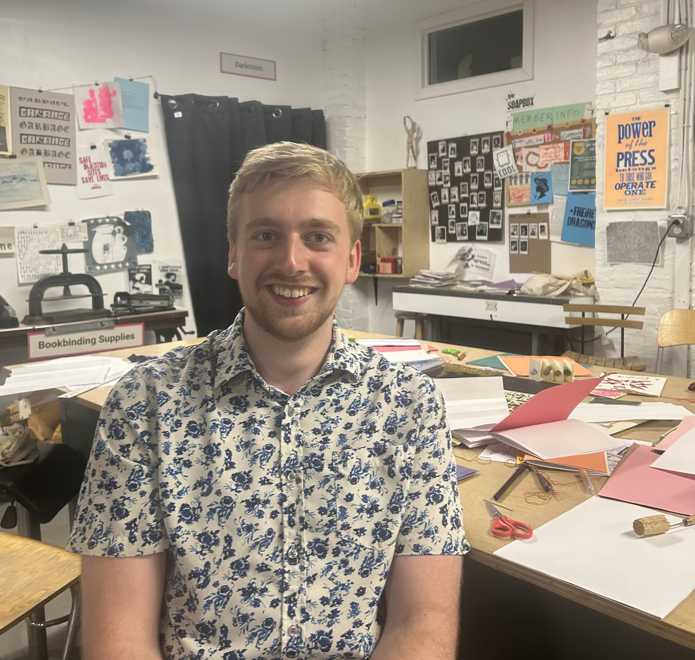
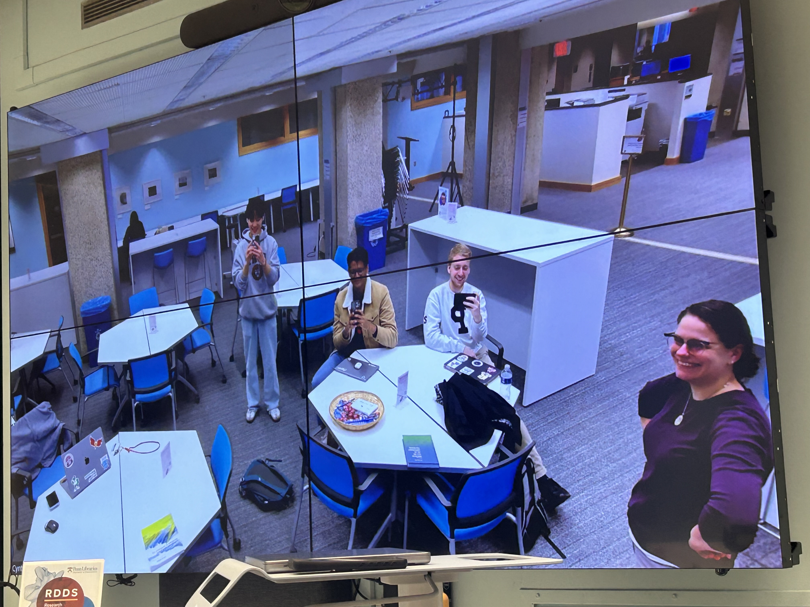

# Justin's Repository
Please use the navigation below to explore my interests and experiences relating to the class Intro to Digital Humanities.

## Navigation
- [About Me](aboutme.html)
- [Reflection Statement](statement.html)
- [Looking Forward Statement](lookingforward.html)
- <a href="https://printinginprisons.org/blog/sewardj/" target="_blank">My Essay on Joseph Welch</a>
- [Digital Humanities Project on Confederate Commemoration](https://falseimage.pennds.org/)

## Highlights

    

        
        
Zine Making

    

    

        
        
Python Workshop

    

[Return to Main Page](README.md)
