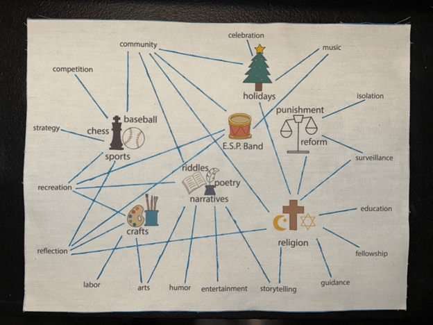

# Reflection Statement

I came into this course with a background in digital humanities, having spent the past three years working on projects that bring together historical research and digital presentation and analysis. This experience introduced me to the complexities of working with unstructured historical data, the challenges of representing marginalized voices, and the importance of developing technical skills for analyzing and presenting information. In the summer of 2022, I began working on a project supported by the Penn Center for Undergraduate Research and Fellowships (CURF) with Dr. Donovan Schaefer, documenting the views of the Black press on Confederate commemoration. Over the summer of 2023, I continued this project as a Mellon Fellow in the Price Lab for Digital Humanities. In 2024, I received further support from CURF and the Center for the Study of Ethnicity, Race, and Immigration to carry the work forward. This research forms the foundation of my senior honors thesis in sociology, which examines how the Black press engaged with Confederate commemoration to articulate broader concerns about race and memory. While I had developed ideas about methodology, technical skills, and ethics through my work, this course gave me the opportunity to reflect on those experiences and connect them to discussions in the field of digital humanities. By engaging with readings, class discussions, and hands-on projects, I was able to think more deeply about the choices I make in my research and how they fit into larger debates about the nature and purpose of digital humanities scholarship. This process has clarified how I approach my own work through its methodology, ethics, and technical skills. 

One of the key challenges of humanistic data collection is the absence of structured tools like surveys to answer historical questions. In sociology, historical studies are often described as “natural experiments” because the available data—such as newspapers, meeting minutes, or voting records—was not intentionally created for scholarly analysis. To make meaningful comparisons, these natural experiments require coding qualitative data into variables. In my project, this has involved analyzing historical newspaper archives to draw insights about Confederate commemoration. This approach highlights the importance of textual records like those in The Umpire for understanding broader social patterns. As Dorothy Berry emphasized in “The House Archives Built,” researchers working with data about marginalized groups often face additional challenges. The data is rarely complete or neatly organized. This puts the responsibility on digital humanities scholars to reconstruct the past with as much accuracy as possible while acknowledging the limitations of the available sources. This methodological challenge resonated throughout the semester, particularly as we engaged with the text from the Umpire and other sources and considered how to use them for analysis.

The course also highlighted the ethical implications of digital humanities work. Readings like Katherine Hepworth and Christopher Church’s “Racism in the Machine,” the Digital Panopticon’s exploration of convict data ethics, and Jennifer Guiliano and Carolyn Heitman’s discussion of Indigenous data emphasized that data is never neutral. It reflects the identities, values, and power structures of the communities it represents. This raises significant ethical questions for researchers about how to present data responsibly. In my own research, I’ve grappled with how to present the views of the Black press on a public website. Ideally, I would simply make the raw text available for public access, ensuring transparency and authenticity. However, copyright laws and practical considerations, like the attention span of readers, make this approach unrealistic. Instead, my team developed a <a href="https://falseimage.pennds.org/essays/" target="_blank">consistent narrative voice</a> that emphasized direct quotations to represent the Black press’s views as faithfully as possible. We avoided overgeneralizing or making claims beyond what the articles themselves stated. Our focus was on identifying trends within the articles rather than extrapolating broader political or ethical conclusions. This approach mirrored the challenges we encountered in our Umpire and EC projects. For my Umpire essay on the <a href="https://printinginprisons.org/blog/sewardj/" target="_blank">Rev. Joseph Welch</a>, I applied the same principles, presenting the patterns I observed in the text without making unsupported claims about its ethical or political context. In our EC project, which involved creating a network map of the lives of incarcerated individuals at ESP, we similarly chose to focus on the topics mentioned in the text rather than interpreting individual perspectives. This decision reduced the potential for misrepresentation but also limited the depth of our analysis. With more time, we could have explored the prisoners’ sentiments toward specific topics, adding a richer dimension to the project.

On a more technical level, this course provided valuable opportunities to refine my HTML and Markdown skills. These tools have been essential to my Black press project, but they have often been a source of frustration. Practicing these skills in the context of class projects allowed me to build confidence and efficiency. Additionally, learning about the history of computing added a layer of depth to my understanding of these tools. By understanding how computers function and “think,” I’ve gained a stronger foundation for navigating technical challenges in my work.

Organizing the various parts of what goes into digital humanities, this class has helped me make connections between methodology, ethics, and technical skills in data presentation and analysis. It reinforced the importance of approaching historical data with care and understanding the responsibilities involved in representing marginalized voices. Through class readings, discussions, and projects, I gained a clearer framework for thinking about my own work. These insights will inform how I approach future research and continue to engage with the challenges of digital humanities. 

### Looking Forward

Consider my Looking Forward essay found [here](lookingforward.html) to see how I envision using these insights in the future.

[< back](DH.html)
